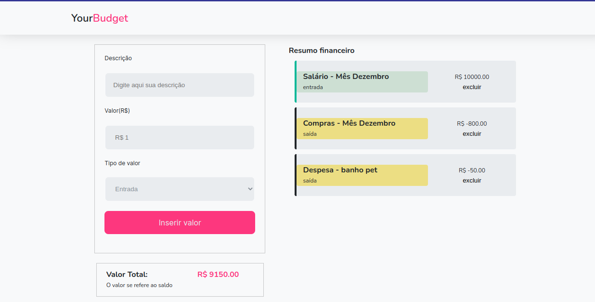

<h1 align="center">Projeto YourBudget</h1>

## Sobre

Plataforma de gereciamento de gastos capaz de cadastrar e persistir informações de entradas e saídas financeiras.
Você poderá conferir a aplicação através da seguinte URL https://your-budget-eight.vercel.app/

<div align="center">


</div> <br>

<p align="center">
</img>
</img>
</img>
</img>

</p>

## Tecnologias Usadas 🛠️

- [Vite](https://vitejs.dev)
- [React](https://react.dev/)
- [Styled Components](https://styled-components.com/)
- [React HookForm](https://react-hook-form.com/)
- [Zod](https://zod.dev/)

## Estrutura do Projeto 📂

```
├── src
│ ├── assets
│ ├── components
│ ├── pages
│ ├── styles
│ ├── App.jsx
│ └── main.jsx
├── .gitignore
├── index.html
├── .GUIDE.md
├── package-lock.json
├── package.json
├── README.md
└── vite.config.js
```

## 💛

<br>
